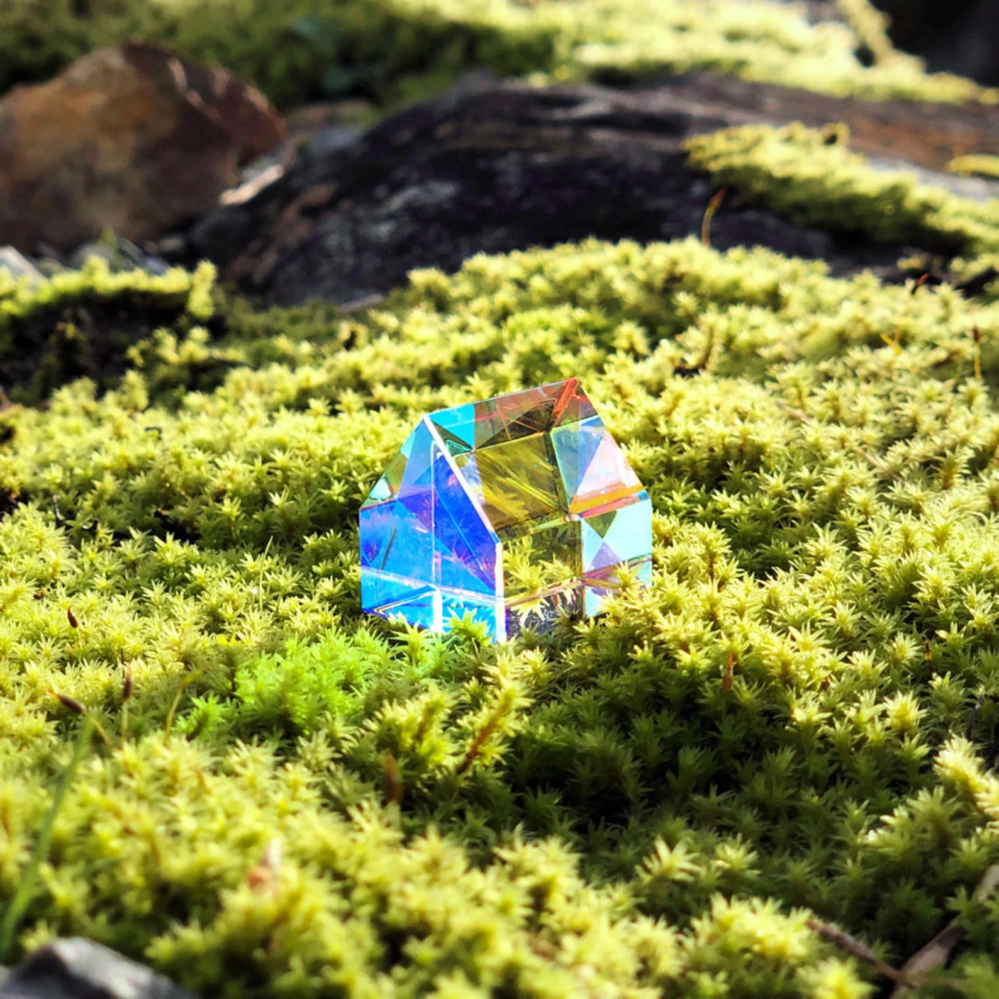

# MultiModal Transformer Lens Library
<div style="display: flex; align-items: center;">
  
  
  
</div>

The library is under active development, thus usage guides coming after done with basic functionality.

MultiModal Transformer Lens is an open-source mechanistic interpretability library for multimodal models. This library is largely based on [TransformerLens](https://github.com/neelnanda-io/TransformerLens) by Neel Nanda and [Prisma](https://github.com/soniajoseph/ViT-Prisma)

*Contributors:* [Ivan Kartashov](https://github.com/kartashofs)

## Features

### Attention head visualization


<div style="display: flex; align-items: center;">
  
  
  
</div>

### Activation patching


### Direct logit attribution


### Emoji logit lens
<div style="display: flex; align-items: center;">


</div>

# Citation
```
@misc{joseph2023vit,
  author = {Sonia Joseph},
  title = {ViT Prisma: A Mechanistic Interpretability Library for Vision Transformers},
  year = {2023},
  publisher = {GitHub},
  journal = {GitHub repository},
  howpublished = {\url{https://github.com/soniajoseph/vit-prisma}}
}
```
